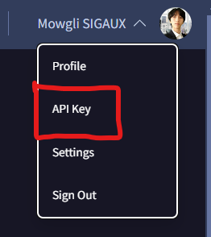

# Analyrun
This Python script analyzes the reputation of IP addresses using VirusTotal and AbuseIPDB services. It provides options to check individual IPs or lists of IPs from text files.

# Features
- **VirusTotal**: Checks if an IP address is reported as malicious using the VirusTotal API.
- **AbuseIPDB**: Evaluates the confidence of an IP address using the AbuseIPDB API.
- **Text files**: Analyzes lists of IPs from text files.
- **Results saving**: Option to save detected malicious IP addresses to a file.

# Installation
1. **Clone the repository**
```sh
git clone https://github.com/MalwareEZ/analyrun
cd analyrun
```

2. **Install dependencies**
```sh
pip install -r requirements.txt
```

# API Keys Configuration
1. Modify **api_keys.json**
- Replace the **virustotal** and **abuseipdb** fields with your respective API keys obtained from the corresponding service websites.

Example structure of **api_keys.json**:
```json
{
    "virustotal": "your_virustotal_api_key",
    "abuseipdb": "your_abuseipdb_api_key"
}
```

# Obtaining VirusTotal API Key
1. Create an account on VirusTotal:
- Visit the official [VirusTotal website](https://www.virustotal.com/) and create an account if you don't already have one.

2. Access your user profile:
- Log in to your VirusTotal account.
- Click on your username at the top right of the page to access your profile.

3. Navigate to the API section:
- In your profile, look for the tab or link named "API Key" in the menu.



4. Generate an API key:
- If you haven't generated an API key yet, follow the instructions to generate one.
- Copy the generated API key and keep it securely.

5. Add your API key to api_keys.json:
- Open the api_keys.json file in your project.
- Replace the empty value for "virustotal" with your VirusTotal API key, for example:

```json
{
    "virustotal": "your_virustotal_api_key",
    "abuseipdb": ""
}
```

# Obtaining AbuseIPDB API Key
1. Create an account on AbuseIPDB
- Visit the official AbuseIPDB website and create an account if you don't already have one.

2. Access the API section:
- Log in to your AbuseIPDB account.
- Navigate to the "API Key" or "Generate API Key" section in your account settings.

3. Generate an API key:
- If you haven't generated an API key yet, follow the instructions to generate one.
- Copy the generated API key and keep it securely.

4. Add your API key to api_keys.json:
- Open the api_keys.json file in your project.
- Replace the empty value for "abuseipdb" with your AbuseIPDB API key, for example:

```json
{
    "virustotal": "your_virustotal_api_key",
    "abuseipdb": "your_abuseipdb_api_key"
}
```

# Usage
- **Analyze a single IP with VirusTotal**
```sh
python main.py virustotal -t <ip_address>
```

- **Analyze a single IP with AbuseIPDB**
```sh
python main.py abuseipdb -t <ip_address>
```

- **Analyze a file of IPs with VirusTotal**
```sh
python main.py virustotal -f path_to_your_file.txt
```

- **Analyze a file of IPs with AbuseIPDB**
```sh
python main.py abuseipdb -f path_to_your_file.txt
```

- **Analyze with both services**
```sh
python main.py all -f path_to_your_file.txt
```

# Saving Results
At the end of the analysis, the script prompts to save detected malicious IP addresses to a specified file.
